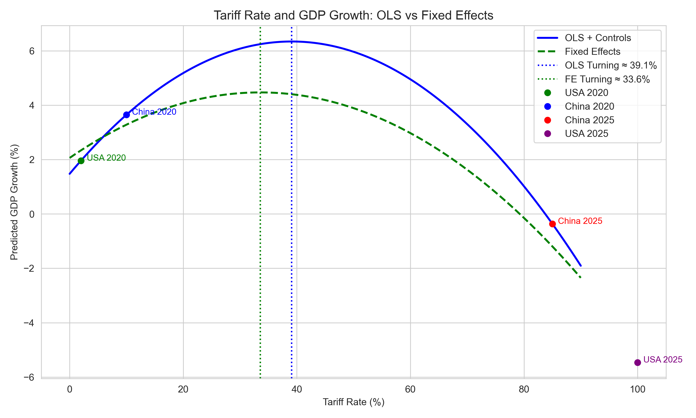

# Tariffs and Economic Outcomes: A US–China Comparison in Global Context  
**Analyzing the effects of protectionist policy on growth, FDI, and trade flows**  
*Panel Data Analysis of 30 Countries, 1990–2024*

---

## Abstract

This study investigates the economic impact of tariff rates using panel data from **30 countries (1990–2024)**, with a focused comparison between the **United States and China**. Drawing entirely from World Bank data and spatial mapping via QGIS, it explores whether tariffs stimulate or hinder economic performance, especially GDP growth, FDI, and trade balance. The analysis includes OLS and fixed effects models, visual trend analysis, and spatial interpretation through maps.

Findings suggest a **nonlinear relationship** between tariffs and GDP growth: while moderate tariffs may support growth, excessive rates are associated with economic decline. The US and China present contrasting trajectories—offering lessons on the limits and potential of protectionist policy.

---

## Research Question

> **Do tariffs promote or hinder economic performance in the modern global economy?**

We assess this by evaluating how tariff rates affect:
- GDP growth
- FDI inflows/outflows
- Trade balance  
…across 30 countries, with a focused lens on the USA and China.

---

## 1. Data and Scope

### Sources

- [**World Bank WDI (1990–2024)**](https://databank.worldbank.org/source/world-development-indicators):  
  GDP (levels and growth), tariffs, FDI, exports/imports, inflation, and population

- [**Natural Earth (Admin 0 – Sovereignty shapefile)**](https://www.naturalearthdata.com/downloads/110m-cultural-vectors/):  
  Used for spatial mapping in QGIS

### Sample

- **30 countries**
- Time span: **1990–2024**
- Special focus: **USA and China**

---

## 2. Tools and Script

### Primary Script

All work is conducted using one unified script:  
📄 `Tariffs-Impact-new.py`

### Functions:

- Cleans and reshapes WDI data
- Computes trade balance, FDI (in billions), GDP growth %
- Prepares CSV outputs for QGIS and regression
- Plots time series, scatterplots, and regression curve
- Exports Stata-ready files for fixed effects model estimation

---

## 3. Regression Approach

We estimate a nonlinear effect of tariffs on GDP growth via:

```
GDP_growth = β0 + β1(Tariff) + β2(Tariff²) + Controls + ε
```

* **OLS** turning point ≈ **39.1%**
* **Fixed Effects** (Stata) turning point ≈ **33.6%**

*Controls include the **Inflation Rate (CPI)** and fixed effects (in the panel model).*


This suggests a **growth-maximizing tariff rate exists**, beyond which economic performance begins to decline. The quadratic curve is visualized in `tariff_gdp_growth_curves.png`, which also highlights where the **USA and China** fall relative to this turning point — with China historically closer to the optimal range, and the USA on the declining side after its post-2016 protectionist shift.


We also conducted additional regressions with **FDI** and **Trade Balance** as dependent variables to evaluate the broader economic effects of tariff policy:

* **FDI Regression**

  ```
  FDI = γ0 + γ1(Tariff) + γ2(Tariff²) + Controls + ν
  ```

  Results show a weak-to-negative relationship between tariffs and FDI inflows, suggesting that higher tariff rates may reduce foreign investment by increasing market uncertainty and reducing openness.

* **Trade Balance Regression**

  ```
  TradeBalance = δ0 + δ1(Tariff) + δ2(Tariff²) + Controls + ξ
  ```

  Findings indicate that higher tariffs do not significantly improve the trade balance. Persistent U.S. deficits despite tariff hikes imply that deeper structural factors (e.g., consumption patterns, currency valuation, and global supply chains) play a more dominant role than tariff policy alone.

---

## 4. Visualizations and Argument Integration.

Charts located in `/charts/` support key arguments throughout:

### `gdp_trend.png`  
  
Shows diverging GDP trajectories. China's GDP grew steadily post-WTO accession, while the USA maintained stable but slower growth.

### `tariff_trend.png`  
  
Demonstrates China’s liberalization vs. the USA’s post-2016 rise in tariffs, emphasizing the policy divergence.

### `fdi_trend.png`  
  
Reflects confidence in China during its reform period. USA’s FDI is more cyclical and responds to investor sentiment.

### `trade_balance_trend.png`  
  
Displays persistent US deficits and China’s surpluses, despite shifts in tariff policy—undermining the idea that tariffs alone can fix trade imbalances.

### `scatter_tariff_fdi.png`  
  
Reveals a weak-to-negative correlation between tariff rates and FDI inflows for both countries—suggesting higher tariffs deter investment.

### `scatter_tariff_gdp.png`  
  
Provides a neutral cross-country view of tariff rates vs. GDP size, reinforcing the need for nonlinear modeling.

### `countries-gdp-growth-1990-2015.png`  
  
Shows long-run GDP performance globally—China among top performers.

### `countries-fdi-2020-graduated.png`  
  
Net FDI flow map: China shows negative value due to major outbound investment.

### `fdi-magnitude-2020-bubble.png`  
  
Visualizes absolute FDI volumes—USA and China as global centers of capital exchange.

### `countries-trade-balance-2020.png`  
  
Color map of surpluses/deficits. Confirms US deficit pattern and China's surplus dominance.

### `tariff-rate-2020.png`  
  
Shows current global tariff landscape—USA among high-income countries with rising average tariffs, China moderate.

### `tariff_gdp_growth_curves.png`  
  
Core empirical visualization. Illustrates the nonlinear curve from both OLS and fixed effects models, and plots USA and China at key tariff points (2020 and 2025 projections).

------

## Discussion

The analysis highlights a complex, nonlinear relationship between tariff rates and economic performance, specifically GDP growth, with critical insights from the contrasting cases of the USA and China. 

### Economic Insights from the US–China Comparison

China's sustained economic growth from 1990 to 2024 can be partly attributed to its strategic use of moderate tariff rates, particularly after its accession to the World Trade Organization (WTO) in 2001. The reduction in tariffs facilitated massive inflows of Foreign Direct Investment (FDI), dramatically boosting its manufacturing sector, export capabilities, and overall economic performance. This approach positioned China effectively near the optimal tariff rate indicated by our regression analysis.

In contrast, the USA’s recent shift towards higher tariffs post-2016 did not achieve the intended economic outcomes. Despite imposing protectionist policies aimed at correcting trade deficits and stimulating domestic manufacturing, the trade deficit widened further, and GDP growth remained sluggish. Our regression analysis suggests that the USA moved beyond the optimal tariff threshold, indicating economic inefficiencies associated with overly protective trade barriers.

It is worth noting a key economic nuance: the benefits from protective tariffs—such as domestic capacity building, import substitution, and productivity gains—tend to materialize slowly. These long-term effects are often difficult to isolate from broader structural trends, making evaluation complex. As the professor noted in class discussions, such lagged benefits may only become visible over multiple economic cycles, which challenges simplistic evaluations of tariff efficacy.

This discussion is especially timely given the unfolding 2025 USA tariff crisis, where steep hikes in tariffs have spurred concerns of inflation, retaliatory trade measures, and weakened global investor confidence. While some argue this approach aims to boost domestic industries, the current analysis underscores that without complementary industrial policy and institutional investment, high tariffs may generate more distortion than development. Our data does not reflect significant short-term benefits for the USA post-2016 tariff escalation.

### The FDI and Trade Balance Paradox

The observed divergence between trade balances and FDI flows underscores an important dimension of international economics. The USA's substantial FDI inflows, despite persistent trade deficits, reflect its robust institutional frameworks, stable legal environment, and attractive financial markets. Investors perceive the US economy as a secure destination for capital, offsetting the macroeconomic risks of its deficit.

China’s negative net FDI flows in 2020 indicate its transformation from an FDI-dependent economy to a leading global investor. China's outbound investments—directed toward infrastructure, technology, and resources globally—are strategic moves aimed at enhancing global influence and securing critical economic interests. This transition demonstrates economic maturity and underscores the strategic depth of China's economic policy beyond tariff manipulation.

---

## Conclusion

This research underscores the nuanced economic impacts of tariffs, revealing both the opportunities and limits inherent in protectionist policies. Moderate tariff rates appear beneficial, supporting economic growth by providing necessary protection without isolating economies. However, excessive tariffs clearly emerge as detrimental, hindering growth and investment. The comparative analysis of the USA and China emphasizes the importance of context and economic strategy in determining tariff outcomes. While tariffs alone cannot rectify complex economic imbalances, they can serve strategic purposes when integrated within broader economic policies involving investment strategies, institutional frameworks, and international engagement.

Future research should delve deeper into product-specific and bilateral tariff analyses, explore broader institutional variables, and adopt advanced econometric models to enhance causal inference.

---

## How to Reproduce the Code

Follow these detailed steps to replicate the analysis from data preparation through to final outputs:

### Step 1: Clone the Repository

```bash
git clone https://github.com/HamzahAlkmali/Tariffs-and-Economic-Outcomes-A-US-China-Comparison-in-Global-Contex.git
cd Tariffs-and-Economic-Outcomes-A-US-China-Comparison-in-Global-Contex
```

### Step 2: Install Dependencies

```bash
pip install --upgrade pip
pip install -r requirements.txt
```

**Key libraries:** `pandas`, `os`, `matplotlib`, `seaborn`, `statsmodels`

---

### Step 3: Prepare Raw Data Files

1. Create a folder named `data/` in the project root.
2. Download and save the following files with exact filenames:

| Filename                         | Source                            |
|----------------------------------|-----------------------------------|
| `WB-Data-Final-H.csv`           | World Bank WDI (cleaned)          |
| `ne_50m_admin_0_sovereignty.zip`| Natural Earth Shapefile (borders) |

---

### Step 4: Run the Python Script

```bash
python Tariffs-Impact-new.py
```

This script:
- Reads and cleans World Bank panel data
- Computes trade balance, GDP, and FDI indicators
- Exports cleaned datasets to CSV (for QGIS and regression use)
- Creates all plots and visualizations
- Exports regression-ready panel data to `regression_data_full.csv`

> **Note:** All maps (e.g., FDI magnitude and tariff trends) were built using **QGIS**. These maps use the `.csv` output from Python as spatial layers and are styled using geopackages (`.gpkg`) provided in this repository.

---

### Step 5: Review the Outputs

- `combined_data.csv`: For maps and regional summaries  
- `regression_data_full.csv`: For fixed effects panel regression  
- Charts in `/charts/`: e.g., `tariff_gdp_growth_curves.png`  
- Maps (in QGIS): from `Tariff-Maps.gpkg`, `FDI_Bubble.gpkg`  
- QGIS project file: `Tariff-Proj-final.qgz`

---

### Step 6: Run the Stata Regression

1. Open `Regression output/tariff_regression.do` in Stata
2. Ensure the `regression_data_full.csv` is in the working directory
3. Run the `.do` file to generate:
   - OLS and fixed effects regressions
   - Predicted GDP growth vs tariff curves
   - Summary tables and logs

---

### Step 7: Visualize with QGIS 

To view or edit maps:

- Open `Tariff-Proj-final.qgz` in QGIS  
- Layers:
  - `Tariff-Maps.gpkg`: includes GDP growth, trade balance, and tariffs  
  - `FDI_Bubble.gpkg`: includes 2020 FDI magnitude bubble visualization  

You can explore how different countries compare globally, zoom into specific regions, or adjust layer styles as needed.


---

